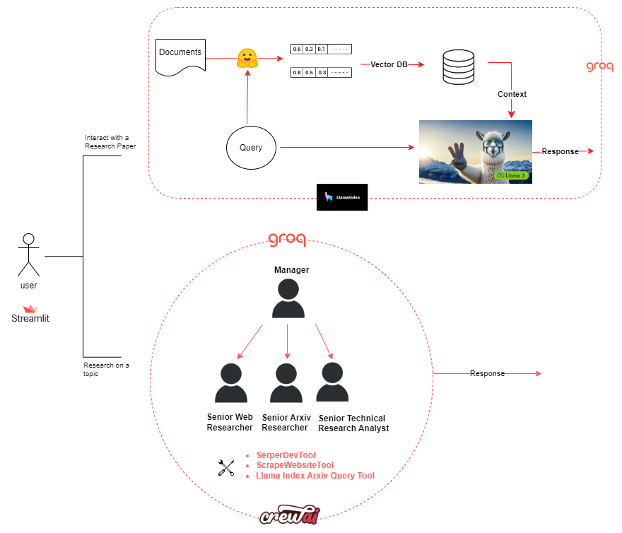
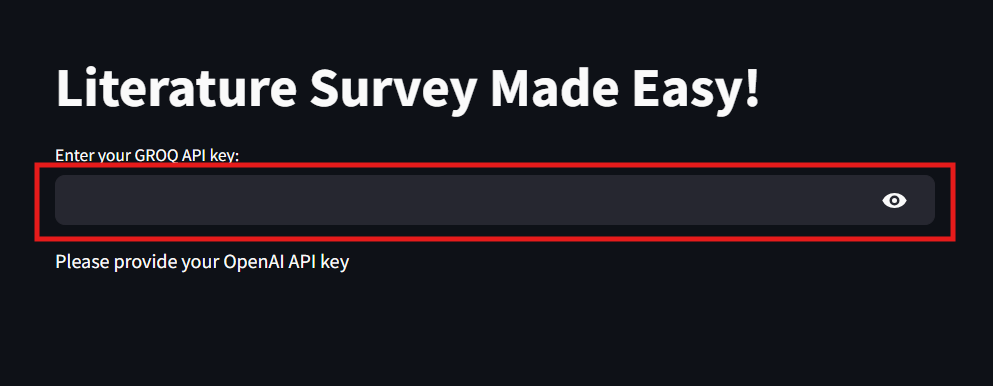
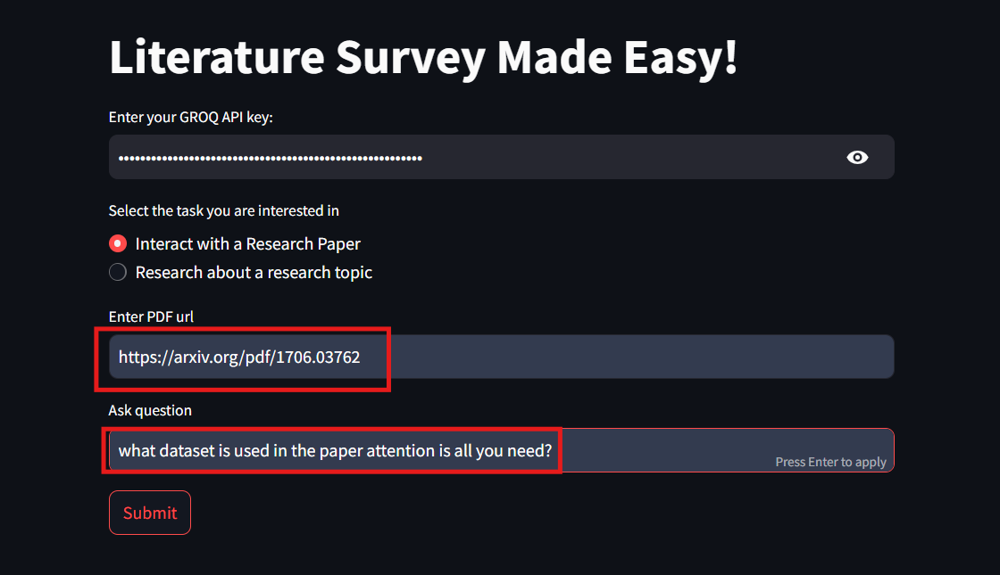
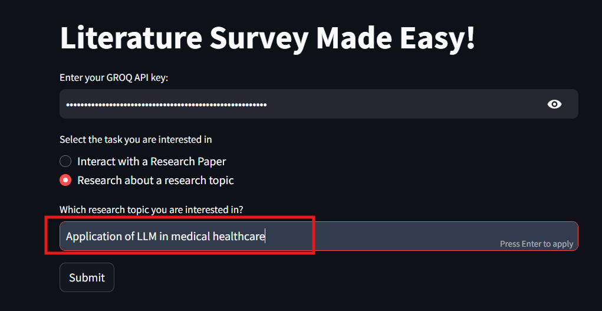

# Personal-Research-Assistant

## Objective
Conducting literature surveys is time-consuming for researchers and students who must sift through numerous academic papers. This project develops an application that streamlines the process, allowing users to search arXiv for relevant papers by keywords, authors, or topics, receive concise summaries, and interact with the content through Q&amp;A.

## Architecture

## Initial Set up
1. Clone repository\
`git clone https://github.com/Dheeraj2444/Personal-Research-Assistant.git`

2. Navigate to project directory\
`cd Personal-Research-Assistant`

3. Install all requirements\
`pip install -r requirements.txt`

4. Create `.env` file similar to `example.env`\
`touch .env`

5. Generate your Serper dev API and Groq API\
    a. Visit https://console.groq.com/keys for Groq API\
    b. Visit https://serper.dev/ for serper dev API

6. Add API keys generated above in the `.env` file

7. Run the Streamlit Application\
`streamlit run main.py`

## Steps to use the Application
1. Add your Groq API key

2. To interact with a reserach paper\
    a. Select _Interact with a Research Paper_\
    b. Add `url` to access the pdf\
    c. Ask any question you have and hit Submit

3. To research about a topic\
    a. Select _Research about a topic_\
    b. Add a research topic you are interested in and hit Submit

## Example Results
Navigate to the `results` directory to see some of the results generated by the application.  